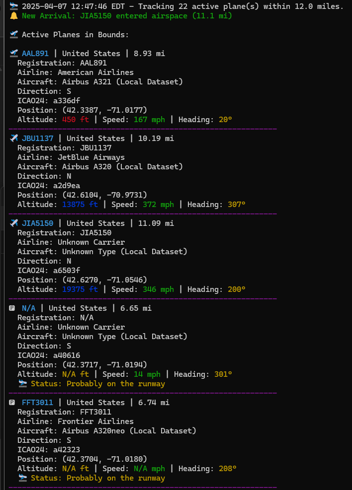

 

# AirTrack 

Author: John Kordis

AirTrack is a real-time aircraft tracker that displays flight data overhead using the OpenSky Network API. I started with a script I made myself and worked with ChatGPT to help pretty it up a bit. A lot of the cosmetic stuff I've never done before so I used this as a learning experience through LLM. A while back, I had the idea of wanting to code something that shows me what planes are near me because I live near a local airport and on the flightpath to a larger hub airport. This is just a way for me to practice a bit.

##  Features

- Live aircraft tracking within a user-defined radius
- Displays airline, aircraft model, altitude, speed, heading, direction
- Shows if aircraft is likely on the runway. Making assumptions on speed and altitude
- Aircraft data sourced via OpenSky + local json data fallback
- Auto-detects user timezone and local coordinates
- Color-coded output with ASCII animation
- Logs unknown aircraft for enrichment
- If you want to change the refresh rate you can do so in the code pretty easily





## Setup

### 1. Clone This Repository
```bash
git clone 
cd airtrack
```

### 2. Install Dependencies
```bash
pip install -r requirements.txt
```

### 3. Files You’ll Need
- `aircraft_types.json` – local fallback aircraft types. This is best guess work.
- `airlines_full.json` – large list of airline code-to-name lookup

These should be placed in the same directory as `tracker.py`.

### 4. Run the Tracker
```bash
python tracker.py
```

You’ll be prompted to:
- Enter your **OpenSky Network** username/password
- Enter your **radius in miles**
- Enter your **address** (will be converted to coordinates)

## Notes

- OpenSky requires free registration for API access: https://opensky-network.org
- Aircraft metadata is rate-limited — fallback is used automatically if metadata is missing.
- Unknown aircraft ICAO codes are logged to `missing_aircraft.log`

## Sample Output

```
 JBU1555 | United States | 11.1 mi
  Airline: JetBlue Airways
  Aircraft: Airbus A320 (OpenSky)
  Altitude: 3,400 ft | Speed: 285 mph | Heading: 77°
  Status: Probably on the runway
```

## To-Do

- I want to make a graphical menu that will split options such as "Find the closest plane to me" and include a map option.
- I intend on adding an area for output to ESP32 module with a screen.
- Code in more address types. Zip code, county, etc.
